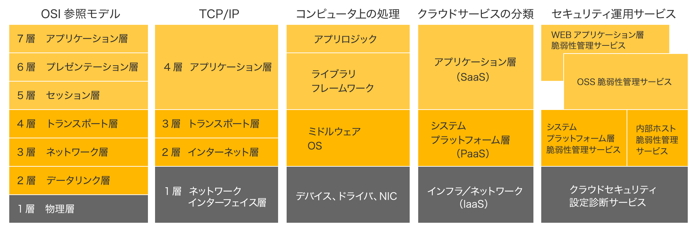

# クラウドサービスについて

## 予備知識

本項では各クラウドサービスが提供するPaaSやSaaSといったサービスの分類とそれぞれの管理範囲を説明する。

| 分類 | 正式名称 | 概要 | サービス例 |
|:------|:-----|:-----|:------|
| オンプレミス | - | ハードウェアからアプリケーション、スケーリングに至るすべてをユーザーが所有する。 | ※特定のサービスではなく、すべて自前で構築する構成である |
| SaaS | Software as a Service | クラウドプロバイダによって管理、維持、保護される特定目的用のアプリケーション一式を使用するが、ユーザーのデータはユーザーが管理する。 | CircleCI |
| FaaS | Fanctions as a Service | 特定のタスクを実行する小さなコードまたは関数をビルドしてデプロイでき、関数の実行時に必要に応じてスケールを追加する。 | Lambda(AWS) |
| PaaS | Platform as a Service | サーバー管理とスケールアップはクラウド プロバイダに任せる。 | RDB(AWS) |
| CaaS | Containers as a Service | コンテナ化されたアプリケーションをデプロイし、基盤となるオペレーティング システムを気にすることなく、スケーリングとランタイムを管理できる。 | EKS(AWS) |
| IaaS | Infrastructure as a Service | ハードウェアをレンタルしてそこでアプリケーションを実行するが、OS、ランタイム、スケーリング、およびすべてのデータの管理はユーザーの責任範囲となる。 | EC2(AWS) ※クラウドサービス自体をIaaSとして見る場合も多い(AWS, Azure, GCPなど) |

  

## 3大クラウド(Amazon Web Service(AWS)/Microsoft Azure/Google Cloud Platform(GCP))比較

|   | AWS | Azure | GCP |
| - | - | - | - |
| 運営元| Amazon| Microsoft | Google |
| シェア率(2023年)| 32%| 23%| 9% |
| 特徴| 世界で最も利用されており、ハイレベルなセキュリティ体制を有する| WindowsやOffice製品との相性が良い| Googleのインフラや先端技術の恩恵を受けられる |
| メリット| - 200を超えるサービスの提供 - 他社サービスとの連携もスムーズ - 245の国と地域で使える| - Microsoft製品との相性が抜群 - 各業界向けのソリューションが充実 - 無料で使えるサービスもある | -安定したインフラ環境 - AIやデータ分析のサービスが充実 |
| デメリット | - コスト管理が複雑 - 最適なサービスを選びにくい | - AWSと比較すると情報量が少ない - 使いこなすには固有の知識が必要 | - リージョン数が少ない - 日本語への対応が不足 |
| 仮想サーバー| 独自の高スペックCPUが搭載されている | オンプレミスとの連携がしやすい | CPUの性能が高い |
| データベース| 対応できるデータベースの数が多い| SQL Serverとの相性が抜群| 独自開発のデータベースを使っている 他のデータベースからの移行も可能 |
| ストレージ| 読み取り遅延が短く、暗号化も強固| 冗長ストレージにより、リージョンの機能が停止してもデータは失われない| 短時間で大量データの処理が可能 |
| 課金単位| 従量課金制 （時間単位の課金 or 秒単位の課金なのかは、使用するサービスによって異なる）| 従量課金制 （分単位の課金がメイン）| 従量課金制 （一定時間が経過すると、秒単位の課金に切り替わる） |
| 利用目的 | - 海外にも拠点があり、世界各国でクラウド環境を利用したい - 柔軟性・拡張性が高いクラウドサービスが必要 - 豊富な機能を利用したい | - Microsoft製品とクラウドを融合させたい - 業界別のソリューションが必要 - 高い可用性・拡張性が必要なWebサービスを提供している | - できればクラウド費用を抑えたい - AI開発やビッグデータ分析などの最新技術を活用したい |

### 導入事例

- [AWS](https://aws.amazon.com/jp/solutions/case-studies)
- [Azure](https://www.microsoft.com/ja-jp/biz/nowon-azure/default.aspx)
- [GCP](https://cloud.google.com/customers?hl=ja)

### エミュレート

| AWS | Azure | GCP |
| - | - | - |
| localstack (皆さん経験があるはずなので今回は割愛、後ほど構築手順用意します) | [Azurite](./emulate/azurite-example.md) | [GCP Emulaters](./emulate/gcp-emulaters-example.md) |

## 参考サイト

- [SaaS,PaaS,IaaSとは？](https://www.itmanage.co.jp/column/saas-paas-iaas/)
- [PaaS、IaaS、SaaS、CaaS の違い](https://cloud.google.com/learn/paas-vs-iaas-vs-saas?hl=ja)
- [【比較一覧】AWS/Azure/GCPの違いは？](https://giginc.co.jp/blog/giglab/aws-azure-gcp)
